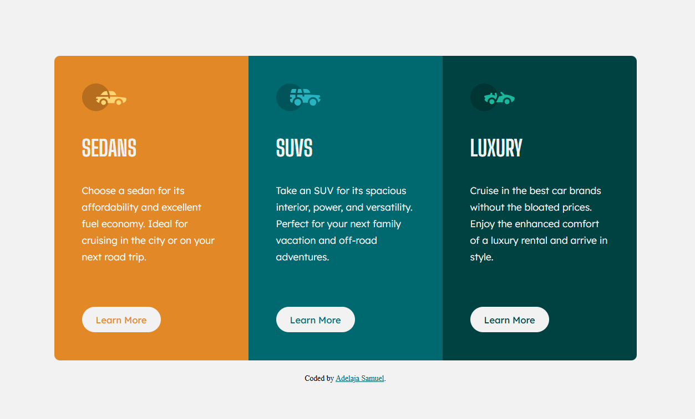

# Frontend Mentor - 3-column preview card component

This is a solution to the [3-column preview card component challenge on Frontend Mentor](https://www.frontendmentor.io/challenges/3column-preview-card-component-pH92eAR2-).

### Links

- Solution URL: [Add solution URL here](https://github.com/samuel-faith/Blog-preview-card)
- Live Site URL: [Add live site URL here](https://samuel-faith.github.io/Blog-preview-card/)

## My process

### Built with

- Semantic HTML5 markup
- CSS custom properties
- Flexbox
- Mobile-first workflow

### What I learned

Use of CSS propoerties to position components on web pages, and make them mobile responsive.